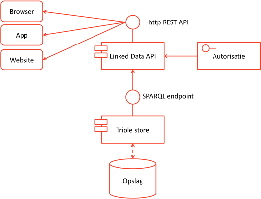

# Ondersteuningswijze

## Architectuur

Onderstaand figuur geeft een overzicht van de architectuur waarmee een linked data set kan worden gepubliceerd:

### Triple store

De basis voor de opslag van linked data is een triple store. Een triple store is een database die specifiek is ingericht op het efficiënt opslaan en ontsluiten van data die als triples zijn geordend. De meeste triple stores zijn tegenwoordig eigenlijk een quad store. Een quad store is een triple store die het mogelijk maakt om ook de 'context', de graph op te slaan. Aan iedere triple wordt de graph als context toegevoegd, waardoor een quad (graph – subject – predicate - object) ontstaat.

### SPARQL endpoint

Standaard kent een triple store de mogelijkheid om via een SPARQL-endpoint data op te vragen uit deze store. SPARQL (SPARQL Protocol and RDF Query Language) is een door de W3C gedefinieerde zoektaal die gebruikt wordt om een triple store te bevragen via zoekopdrachten. Dit gebeurt met een standaard protocol op basis van een zogenaamde http RESTful service [[GRAPHSTORE](references.md#graphstore)] [[SPARQL11](references.md#sparql11)].

In het voorbeeld van de BAG kan aan een SPARQL endpoint bijvoorbeeld de volgende vraag worden gesteld. Deze vraagt de gegevens op van het pand aan de Krankeledenstraaat 30 in Amersfoort:

    prefix bag: http://bag.kadaster.nl/def#
    select ?pand ?eigenschap ?waarde
    where {
      ?openbareRuimte bag:naamOpenbareRuimte "krankeledenstraat".
      ?nummeraanduiding bag:gerelateerdeOpenbareRuimte ?openbareRuimte.
      ?nummeraanduiding bag:huisnummer "30".
      ?verblijfsobject bag:hoofdadres ?nummeraanduiding.
      ?verblijfsobject bag:onderdeelVan ?pand.
      ?pand ?eigenschap ?waarde
    }

Om zo’n vraag te kunnen stellen is toch wel wat gespecialiseerde SPARQL kennis nodig. Deze vraag levert ook een antwoord op dat een standaard SPARQL vorm heeft. Dit is niet de meest praktische vorm. Daarom is er een Linked Data API (application programming interface). Dit is een verzameling definities op basis waarvan een computerprogramma kan communiceren met de triple store.

### Linked Data API
De Linked Data API is een voorziening die het mogelijk maakt om antwoord te geven op URLs en URL-Vragen naar linked data. Zo kun je direct in de browser de volgende relatief eenvoudige URL-vraag stellen:

`http://bag.kadaster.nl/query/pand-aan?naamOpenbareRuimte=Krankeledenstraat&amp;huisnummer=30&amp;woonplaatsnaam=Amersfoort`

Als deze vraag wordt gesteld vanuit de browser herkent de API dat en toont deze als antwoord een nette, in de gewenste huisstijl van de organisatie opgemaakte webpagina.

Het is ook mogelijk om een voor programmeurs aantrekkelijk protocol te gebruiken, namelijk RESTful services [REST] die JSON [JSON] retourneren. Daardoor hebben programmeurs niet (veel) kennis nodig van Linked Data om een app of programma maken waarin linked data wordt gebruikt.

De API biedt bovendien de mogelijkheid om autorisatie toe te passen op de getoonde informatie, zodat alleen geautoriseerde personen toegang hebben tot de gegevens. Dan zijn het niet meer open data, maar moet er bijvoorbeeld voor worden betaald of zijn bepaalde data niet voor iedereen toegankelijk.

De Linked Data API kent als interface een ‘normaal’ http endpoint. Dat betekent dat http GET requests afgehandeld worden door de Linked Data API. Voor de specificaties van de Linked Data API bestaan op dit moment twee varianten:

* De vrij generieke en vanuit de W3C opgestelde Linked Data Platform (LDP) [LDP];
* De meer specifieke en op implementatie gerichte Linked Data API specificatie [LDAPI].

Door het aanbieden van een Linked Data API kunnen verschillende systemen aansluiten op de Linked Data API:

* Een App, waarbij de App via een RESTful JSON http service gegevens opvraagd van de Linked Data API;
* Een website, waarbij http links zijn opgenomen. Door te klikken op de website, navigeer je naar de website, en zal in de browser van de gebruiker de linked data als een html webpagina worden getoond;
* Een informatiesysteem, waarbij een machine-naar-machine interface is geïmplementeerd door middel van een RESTful http webservice. Daarmee biedt deze architectuur de mogelijkheid om opgenomen te worden in een SOA landschap (maar dan niet met een SOAP webservice [SOAP], maar een RESTful webservice).
* Een interactieve website, waarbij via Javascript Ajax-calls [AJAX] worden uitgevoerd, zodat de inhoud van het scherm dynamisch kan worden bijgewerkt, bijvoorbeeld voor het tonen van een grafische representatie.

Het bepalen van de vorm waarin het resultaat wordt teruggegeven gebeurt via 'content negotiation'.

## Content negotiation

Het http protocol kent de mogelijkheid van 'content negotiation'. Dit betekent dat op basis van de http-request header, de http server een andere 'vorm' van de webpagina zal teruggeven.

In bovenstaand plaatje is dit uitgebeeld. De URL http://bag.kadaster.nl/doc/pand/0307100000333887 kan hier op drie verschillende manieren worden weergegeven:

* Als 'gewone' webpagina (html), voor menselijke eindgebruikers. Het intypen van de URL in een browser zal normaal gesproken dit gedrag vertonen
* Als JSON-LD document, voor App bouwers die van JSON services houden (de meeste programmeurs);
* Als RDF/XML document, voor de meer hard-core Linked Data specialisten.

Overigens is het gebruikelijk om ook specifiek (los van de http-request header) een formaat op te vragen, door achter de URL een extensie toe te voegen die het formaat weergeeft. Zo geeft onderstaande URL-vraag een JSON response terug.

- `http://bag.kadaster.nl/query/pand-aan.json?naamOpenbareRuimte=Krankeledenstraat&amp;huisnummer=30&amp;woonplaatsnaam=Amersfoort`

Bovenstaand figuur laat ook het http-303 redirect gedrag zien. Op grond van de richtlijnen uit de URI strategie zal de "id" URL leiden tot een http-303 redirect response. Dit leidt ertoe dat de browser opnieuw een pagina zal opvragen, in dit geval de "doc" URL.

## Core vocabulaires

Voor sommige data zijn door de W3C, Inspire of andere instituten zogenaamde 'core vocabularies' ontwikkeld. Core vocabularies zijn beschikbaar voor 'persoon' en voor 'adres'. Voor andere domeinen zijn core vocabularies in ontwikkeling.

Als de ontologie van de BAG wordt verbonden met vCARD of met het INSPIRE vocabulaire, hoeft een gebruiker, bijvoorbeeld een app, de interne structuur en begrippen van de BAG niet eens te kennen en kan deze rechtstreeks op basis van zo’n standaard vocabulaire data van de BAG (bijvoorbeeld de contour, het bouwjaar en de status van een pand) verbinden met data over dit pand van bijvoorbeeld de Rijksdienst voor het Cultureel Erfgoed (RCD) of met data uit DBpedia.
